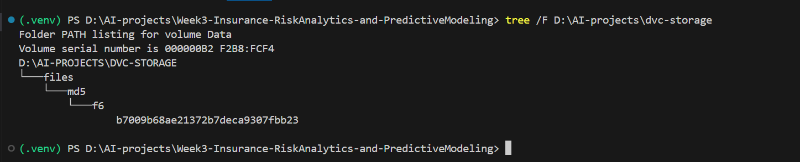

# Week3-Insurance-RiskAnalytics-and-PredictiveModeling

## 📌 Overview

This project performs exploratory data analysis (EDA) on an insurance portfolio dataset covering policies from February 2014 to August 2015. The analysis focuses on understanding risk patterns, profitability metrics (like Loss Ratio), and temporal trends in the insurance portfolio.

## 📂 Project Structure

Week3-Insurance-RiskAnalytics-and-PredictiveModeling/
│
├── .dvc/
├── data/ # Raw and processed data
│ └── MachineLearningRating_v3.txt
│ └── MachineLearningRating_v3.txt.dvc # Original dataset
│
├── notebooks/ # Jupyter notebooks for exploratory analysis
│ └── eda.ipynb # Main EDA notebook
│
├── scripts/ # Python scripts for reproducible analysis
│ └── eda.py # Script version of EDA
│
├── outputs/ # Generated outputs
│ ├── figures/ # Visualizations and plots
│ └── reports/ # Analysis reports
│
├── .github/workflows/ # CI/CD pipeline configuration
│ └── python-ci.yml # GitHub Actions workflow
│
└── README.md # This file

## 🎯 Key Objectives

1. Calculate portfolio-wide Loss Ratio (TotalClaims/TotalPremium)
2. Analyze Loss Ratio variations by:
   - Geographic regions (Province, PostalCode)
   - Vehicle characteristics (Make, Model, Type)
   - Client demographics (Gender, MaritalStatus)
3. Identify temporal trends in claim frequency/severity
4. Detect high-risk vehicle makes/models
5. Assess data quality and identify outliers

## 🔧 Setup Instructions

### Prerequisites

- Python 3.12.4
- Git

### Task 1:Project Planning - EDA & Stats

### Installation

1. Clone the repository:
   ```bash
   git clone https://github.com/Fre-Fentaw27/Week3-Insurance-RiskAnalytics-and-PredictiveModeling.git
   cd Week3-Insurance-RiskAnalytics-and-PredictiveModeling
   ```
2. Create and activate a virtual environment:
   python -m venv venv
   source venv/bin/activate
3. Install dependencies:
   pip install -r requirements.txt
   🛠️ Required Packages
   The project uses the following Python packages:
   pandas
   numpy
   matplotlib
   seaborn
   jupyter (for notebook exploration)
   scipy (for statistical analysis)

### 📊 Key Analyses Performed

1. Data Quality Assessment
   Missing value analysis
   Data type validation
   Outlier detection using IQR and visualization

2. Univariate Analysis
   Distribution of key variables:
   TotalPremium
   TotalClaims
   CustomValueEstimate
   Vehicle characteristics

3. Bivariate/Multivariate Analysis
   Loss Ratio by Province and VehicleType
   Correlation between premium and claim amounts
   Temporal trends in insurance metrics

4. Geographic Analysis
   Regional variations in insurance patterns
   Comparison of coverage types across locations

### 📈 Key Visualizations

Loss Ratio Heatmap by Province and Vehicle Type
Temporal Trend of Monthly Claims vs Premiums
Vehicle Make Risk Profile (Top 10 highest/lowest claim ratios)

### Data Version Control (DVC)

📌 Overview
This project uses DVC to version large datasets, models, and pipelines alongside Git. DVC tracks data files in remote storage (e.g., S3, local) while Git manages metadata (.dvc files) for reproducibility.

🚀 Setup

1. Install DVC
   - pip install dvc
2. Initialize DVC(This creates a .dvc directory with the internal configuration files.)
   - dvc init
3. Configure Remote Storage
   - mkdir -p D:\AI-projects\dvc-storage
   - dvc remote add -d localstorage D:\AI-projects\dvc-storage
     🛠️ Usage
4. Track Data
   - dvc add data/MachineLearningRating_v3.txt # Creates data/MachineLearningRating_v3.txt.dvc
   - git add data/MachineLearningRating_v3.txt.dvc .gitignore
   - git commit -m "Track dataset with DVC"
5. Push to your remote repository
   - git push origin task-2
6. Push Data to Local Remote Storage
   - dvc push
7. Verify Your Setup
   - dvc status # Check DVC status
   - dvc remote list # Check DVC remotes
8. Verification
   
